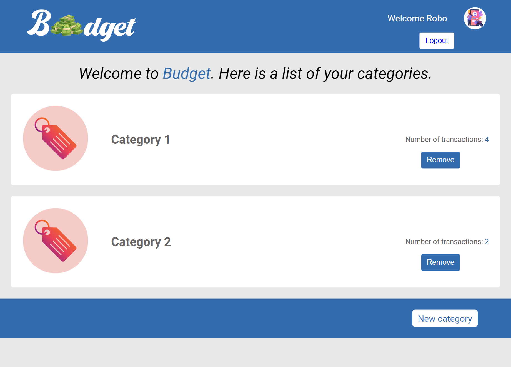
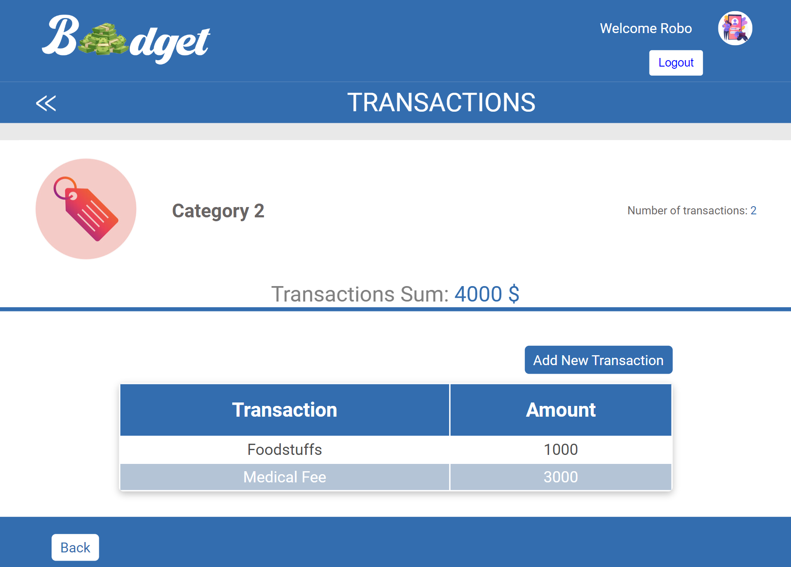

# Budget App

> An application built using Ruby on Rails to manage the expenses of any user. It allows the user the create categories under which are various transactions for the category.

## [Visit Budget App](https://budgetz-app.herokuapp.com/)

[Video link](https://www.loom.com/share/436983f6d98b4e68a5e0f5367744e4b5)
## Screenshot
| Categories Page |   Transactions page |
| ---------- | ----------- |
 |  |  |

## Built With

- Ruby on Rails
- Ruby
- Rubocop

## Getting Started
To get a local copy up and running follow these simple example steps.

### Prerequisites

``VS Code or other Code Editor``

### Setup

``Install Postgres and Ruby applications``

### Install

    git clone https://github.com/Theophileaseh/Budget-app.git

### Usage

``cd Budget-app``

``bundle install``

``Run "rails server or rails s" to start the application on local server``

### Run tests

``Run "rspec" in your terminal``

## Authors

👤 **Nwachan Theophile**

- GitHub: [@Theophileash](https://github.com/Theophileaseh)
- Twitter: [@NwachanT](https://twitter.com/NwachanT)
- LinkedIn: [LinkedIn](https://linkedin.com/in/nwachan-theophile)

## 🤝 Contributing

Contributions, issues, and feature requests are welcome!

Feel free to check the [issues page](../../issues/).

## Show your support

Give a ⭐️ if you like this project!

## Acknowledgments

- credits to Gregoire Vella on Behance. :raised_hands:

## 📝 License

This project is [MIT](./MIT.md) licensed.
